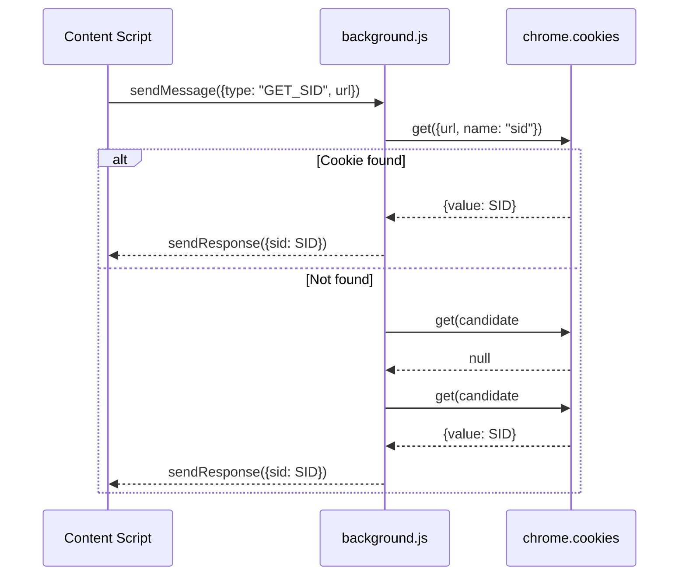

<!-- README.md -->

# 🛠 Salesforce Apex Job Logs Helper

A Chrome extension that enhances the Salesforce **Apex Jobs** page by adding a **Logs** column, allowing users to fetch and download related debug logs directly from the UI. It leverages both **content scripts** (to manipulate the DOM) and a **background service worker** (to obtain session cookies).

---

## 🗂 background.js

**Purpose:**  
Listens for messages from the content script requesting the current session ID (`sid`) and retrieves it from Chrome’s cookie store. It attempts several hostname variations to maximize compatibility across Salesforce domains.

```javascript
chrome.runtime.onMessage.addListener((msg, sender, sendResponse) => {
  if (msg?.type === "GET_SID") {
    const url = msg.url;
    chrome.cookies.get({ url, name: "sid" }, (cookie) => {
      if (cookie?.value) {
        sendResponse({ sid: cookie.value });
      } else {
        // Try alternative host variations
        const u = new URL(url);
        const candidates = [
          `https://${u.hostname}/`,
          `https://${u.hostname.replace(".lightning.force.com", ".my.salesforce.com")}/`,
          `https://${u.hostname.replace(".my.salesforce.com", ".lightning.force.com")}/`
        ];
        let resolved = false;
        let remaining = candidates.length;
        for (const c of candidates) {
          chrome.cookies.get({ url: c, name: "sid" }, (ck) => {
            if (!resolved && ck?.value) {
              resolved = true;
              sendResponse({ sid: ck.value });
            }
            if (--remaining === 0 && !resolved) {
              sendResponse({ sid: null });
            }
          });
        }
      }
    });
    return true; // Indicates async sendResponse
  }
});
```

**Key Concepts:**

- **Message Listener**  
  Listens for `{ type: "GET_SID", url }` and responds asynchronously.

- **Cookie Retrieval Strategy**  
  1. Direct origin cookie (`https://<origin>/`)  
  2. Swap between `.lightning.force.com` and `.my.salesforce.com` subdomains.

- **Async Response**  
  Returns `true` to keep the message channel open until `sendResponse` is called.

### Cookie Resolution Sequence



---

## ✨ content.js

**Purpose:**  
Injects UI enhancements into the Apex Jobs list. It locates the jobs table, adds a **Logs** column, and for each job row, provides a **Fetch logs** button. Clicking it runs SOQL queries against the **Tooling API** to retrieve and render links to debug logs.

---

### 1. Configuration & Helpers

```javascript
const API_VERSION = "62.0";

// Returns current page origin
function getOrigin() { return window.location.origin; }

// ISO date → local string
function isoToLocal(iso) { /* … */ }

// Byte count → human-readable string
function formatBytes(n) { /* … */ }
```

- **API_VERSION** controls the Salesforce API endpoint.
- **getOrigin**, **isoToLocal**, **formatBytes** standardize repeated tasks.

---

### 2. DOM Utilities

| Function         | Description                                          |
|------------------|------------------------------------------------------|
| findJobsTable()  | Locates the table with header “Apex Job ID”.        |
| ensureLogsHeader(headerRow) | Appends a “Logs” `<th>` if missing.        |
| getDataRows(table)| Returns only `<tr>` elements representing data rows. |

```javascript
function findJobsTable() { /* … */ }
function ensureLogsHeader(headerRow) { /* … */ }
function getDataRows(table) { /* … */ }
```

---

### 3. Tooling API Integration 🛠

#### a) Retrieving Session ID

```javascript
function getSid() {
  return new Promise(resolve => {
    if (!chrome?.runtime?.sendMessage) return resolve(null);
    chrome.runtime.sendMessage(
      { type: "GET_SID", url: getOrigin() },
      resp => resolve(resp?.sid || null)
    );
  });
}
```

#### b) Running Tooling Queries

```javascript
async function toolingQuery(soql) {
  const url = `${getOrigin()}/services/data/v${API_VERSION}/tooling/query?q=${encodeURIComponent(soql)}`;
  let res = await fetch(url, { credentials: "same-origin" });
  
  if ([401, 403].includes(res.status)) {
    const sid = await getSid();
    if (sid) {
      res = await fetch(url, { headers: { Authorization: `Bearer ${sid}` } });
    }
  }
  
  if (!res.ok) {
    const text = await res.text().catch(() => "");
    throw new Error(`Query failed (${res.status}): ${text || res.statusText}`);
  }
  
  return (await res.json()).records || [];
}
```

#### c) Fetching Apex Logs

```javascript
async function fetchApexLogs(jobId) {
  const jobSoql = `SELECT Id, ApexClass.Name, CreatedDate, CompletedDate, Status, JobType, CreatedById FROM AsyncApexJob WHERE Id = '${jobId}'`;
  const [jobData] = await toolingQuery(jobSoql);
  const logsSoql = `SELECT Id, StartTime, LogUserId, Operation, Status, LogLength, Request FROM ApexLog
                     WHERE LogUserId='${jobData.CreatedById}'
                       AND StartTime>=${jobData.CreatedDate}
                       AND StartTime<=${jobData.CompletedDate}
                     ORDER BY StartTime`;
  return toolingQuery(logsSoql);
}
```

---

### 4. Download Link Builder

- **Preferred:** REST endpoint with `Authorization` header.
- **Fallback:** Classic console route on `*.my.salesforce.com`.

```javascript
async function buildDownloadHref(rec) {
  const sid = await getSid();
  if (sid) {
    const restUrl = `${getOrigin()}/services/data/v${API_VERSION}/tooling/sobjects/ApexLog/${rec.Id}/Body`;
    const res = await fetch(restUrl, { headers: { Authorization: `Bearer ${sid}` } });
    if (res.ok) {
      const blob = await res.blob();
      return URL.createObjectURL(blob);
    }
  }
  const myBase = toMyDomain(getOrigin());
  return `${myBase}/_ui/system/api/console/apexLogDownload.apexp?id=${rec.Id}`;
}
```

---

### 5. UI Rendering & Interaction

- **renderLinks(container, logs):** Creates `<a>` elements for each log.
- **makeFetchButton(jobId, container):** Builds a button that, on click:
  1. Disables itself & shows “Loading…”
  2. Calls `fetchApexLogs`
  3. Invokes `renderLinks` or shows an error

```javascript
function makeFetchButton(jobId, container) { /* … */ }
function renderLinks(container, logs) { /* … */ }
```

---

### 6. Main Enhancement Loop

```javascript
function ensureRowEnhanced(row, jobIdIdx) { /* adds Logs cell & button */ }

function enhance() {
  const info = findJobsTable();
  if (!info) return;
  const { table, headerRow, jobIdIdx } = info;
  ensureLogsHeader(headerRow);
  getDataRows(table).forEach(row => ensureRowEnhanced(row, jobIdIdx));
}

// Initial run & observe DOM changes (pagination, filters, etc.)
enhance();
new MutationObserver(enhance).observe(document.documentElement, {
  childList: true,
  subtree: true
});
```

#### Enhancement Flowchart

```mermaid
flowchart TD
  A[Page Load] --> B[findJobsTable()]
  B -->|found| C[ensureLogsHeader()]
  C --> D[getDataRows()]
  D --> E{Each Row}
  E --> F[ensureRowEnhanced()]
  F --> G[Append Logs Cell]
  G --> H[Make Fetch Button]
  H --> I[On Click → fetchApexLogs()]
  I --> J[toolingQuery() → retrieve logs]
  J --> K[renderLinks() → display download links]
```

---

## 🎨 styles.css

Defines minimal styling for the **Fetch logs** button and links.

```css
.sflogs-btn {
  font: inherit;
  padding: 4px 8px;
  border: 1px solid #c9c9c9;
  border-radius: 4px;
  cursor: pointer;
  background: #f6f6f6;
}

.sflogs-btn:disabled {
  opacity: 0.6;
  cursor: default;
}

.sflogs-container a {
  text-decoration: none;
}

.sflogs-container a:hover {
  text-decoration: underline;
}
```

- **.sflogs-btn:** Matches Salesforce’s native button style.
- **.sflogs-container a:** Clean link styling with subtle hover effect.

---

## ⚙️ manifest.json

Configures the Chrome extension, declaring permissions, scripts, and hosts.

```json
{
  "manifest_version": 3,
  "name": "Salesforce Apex Job Logs Helper",
  "version": "1.0.0",
  "description": "Adds a Logs column to the Apex Jobs list with direct download links for related debug logs.",
  "permissions": [
    "cookies",
    "storage",
    "scripting",
    "activeTab"
  ],
  "host_permissions": [
    "https://*.salesforce.com/*",
    "https://*.my.salesforce.com/*",
    "https://*.lightning.force.com/*"
  ],
  "background": {
    "service_worker": "background.js"
  },
  "content_scripts": [
    {
      "matches": [
        "https://*.salesforce.com/*",
        "https://*.my.salesforce.com/*",
        "https://*.lightning.force.com/*"
      ],
      "js": ["content.js"],
      "css": ["styles.css"],
      "run_at": "document_idle",
      "all_frames": true
    }
  ]
}
```

| Field               | Description                                                      |
|---------------------|------------------------------------------------------------------|
| **manifest_version**| Specifies version 3 of Chrome’s extension manifest format.       |
| **permissions**     | Requires access to cookies, storage, scripting APIs, and active tab. |
| **host_permissions**| Grants content scripts access to Salesforce domains.             |
| **background**      | Defines `background.js` as a **service worker**.                 |
| **content_scripts** | Injects `content.js` & `styles.css` into matching Salesforce pages at `document_idle`. |

---

## 🚀 Usage

1. Open **chrome://extensions**.
2. Enable **Developer mode**.
3. Click **Load unpacked** and select this extension’s directory.
4. Navigate to **Salesforce → Apex Jobs**.  
   You’ll see a new **Logs** column with **Fetch logs** buttons on each job row.

Enjoy seamless access to your Apex debug logs!